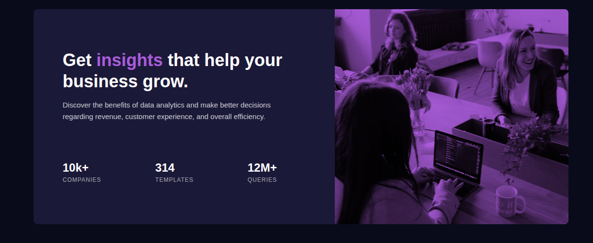

# Frontend Mentor - Stats preview card component solution

This is a solution to the [Stats preview card component challenge on Frontend Mentor](https://www.frontendmentor.io/challenges/stats-preview-card-component-8JqbgoU62). Frontend Mentor challenges help you improve your coding skills by building realistic projects. 

## Table of contents

- [Overview](#overview)
  - [The challenge](#the-challenge)
  - [Screenshot](#screenshot)
  - [Links](#links)
- [My process](#my-process)
  - [Built with](#built-with)
  - [What I learned](#what-i-learned)
  - [Continued development](#continued-development)
  - [Useful resources](#useful-resources)
  - [AI Collaboration](#ai-collaboration)
- [Author](#author)
- [Acknowledgments](#acknowledgments)

## Overview

### The challenge

Users should be able to:

- View the optimal layout depending on their device's screen size

### Screenshot



### Links

- Solution URL: [Add solution URL here](https://www.frontendmentor.io/solutions/pulsevista-3awML1Mqd3)
- Live Site URL: [Add live site URL here](https://freedev-group.github.io/stats-preview-card-component-Kabidu/)

## My process

### Built with

- Semantic HTML5 markup
- CSS custom properties
- Flexbox
- Mobile-first workflow

### What I learned

During this project, I learned how to create a responsive card component using CSS Flexbox and media queries. I practiced using CSS custom properties (variables) for consistent theming and colors. Additionally, I improved my skills in mobile-first design, ensuring the layout works well on both mobile and desktop screens.

```css
:root {
    --main-bg: hsl(233, 47%, 7%);
    --card-bg: hsl(244, 38%, 16%);
    --accent: hsl(277, 64%, 61%);
    --white: hsl(0, 0%, 100%);
    --main-para: hsla(0, 0%, 100%, 0.75);
    --stat-head: hsla(0, 0%, 100%, 0.6);
}
```

This approach made it easier to maintain and update the color scheme throughout the project.

### Continued development

In future projects, I want to focus more on using CSS Grid for complex layouts and explore advanced CSS features like animations and transitions. I also plan to learn JavaScript to add interactivity to my components.

### Useful resources

- [MDN Web Docs - Flexbox](https://developer.mozilla.org/en-US/docs/Learn/CSS/CSS_layout/Flexbox) - This helped me understand Flexbox layout in detail.
- [CSS-Tricks - A Complete Guide to Flexbox](https://css-tricks.com/snippets/css/a-guide-to-flexbox/) - A comprehensive guide to Flexbox properties.
- [Frontend Mentor Community](https://www.frontendmentor.io/community) - Great for getting feedback and inspiration from other developers.

### AI Collaboration

I used AI coding assistants during this project, following the guidelines provided in the AGENTS.md file. The AI helped me understand concepts and provided hints without writing the code for me, which allowed me to learn by doing.

## Author

- Frontend Mentor - [@kabidu Munguakonkwa Sage](https://www.frontendmentor.io/profile/yourusername)

## Acknowledgments

Thanks to Frontend Mentor for providing this challenge and the community for support.
